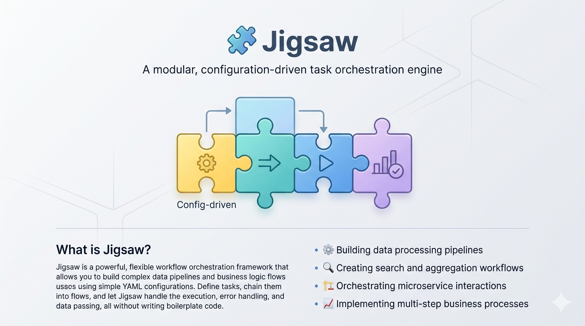

<p align="center">
  
</p>

# 🧩 Jigsaw

**A modular, configuration-driven task orchestration engine for Go**

[](https://golang.org)
[](LICENSE)

---

## 🎯 What is Jigsaw?

Jigsaw is a powerful, flexible workflow orchestration framework that allows you to build complex data pipelines and business logic flows using simple YAML configurations. Define tasks, chain them into flows, and let Jigsaw handle the execution, error handling, and data passing—all without writing boilerplate code.

**Perfect for:**

- 🔄 Building data processing pipelines
- 🔍 Creating search and aggregation workflows
- 🌐 Orchestrating microservice interactions
- 💾 Managing complex caching strategies
- 🔀 Implementing multi-step business processes

---

## ✨ Key Features

### 🎨 **Configuration-Driven**

Define everything in YAML—tasks, flows, providers, and endpoints. No code changes needed for new workflows.

### 🔥 **Hot-Reload**

Modify configurations on the fly. Changes are applied instantly without restarting the server.

### 🧬 **Inheritance System**

Create base tasks and flows, then extend them with inheritance. DRY principle applied to configurations.

### 🔄 **Generic Wrappers**

Add cross-cutting concerns (caching, metrics, logging) at the task level. Wrappers are reusable, transparent, and keep flows clean.

### 🛡️ **Flexible Error Handling**

Multiple fallback strategies: abort, continue with defaults, switch tasks, or failover to alternate providers.

### ⚡ **Parallel Execution**

Run independent tasks concurrently to maximize throughput and minimize latency.

### 🔌 **Provider Abstraction**

Swap databases, caches, and services without changing task definitions. Support for lazy loading and connection pooling.

### 🎯 **Dynamic Routing**

Route requests to different flows based on parameters, headers, or custom tags.

### 📦 **Package-First Design**

Import Jigsaw into any Go project as a library. Use it as a standalone service or embed it in your application.

### 📊 **Structured Logging**

Built-in zerolog integration provides detailed, structured logs for debugging and monitoring.

---

## 🏗️ Architecture Overview

```
HTTP Request → Endpoint → Flow Router → Flow Executor
                                            │
                                            ▼
                                    Task 1 → Task 2 → Task 3
                                       ↓        ↓        ↓
                                    Providers (Cache, Database, APIs...)
```

**Core Concepts:**

- **Task**: A unit of work with inputs, outputs, and logic
- **Flow**: A sequence of tasks executed in order
- **Provider**: External services (DB, cache, API) used by tasks
- **Endpoint**: HTTP routes that trigger flows
- **Context**: Runtime data carrier that passes through the flow

👉 [Read the full architecture documentation](docs/reference/ARCHITECTURE.md)  
👉 [View the ERD and data model](docs/reference/ERD.md)

---

## 🚀 Quick Start

### Installation

```bash
# Install as a package
go get github.com/amkarkhi/jigsaw

# Or clone the repository
git clone https://github.com/amkarkhi/jigsaw.git
cd jigsaw
```

### Basic Usage

```go
package main

import (
    "context"
    "github.com/amkarkhi/jigsaw/pkg/config"
    "github.com/amkarkhi/jigsaw/pkg/engine"
    "github.com/amkarkhi/jigsaw/pkg/validator"
    "github.com/rs/zerolog"
)

func main() {
    log := zerolog.Nop()
    loader := config.NewLoader(log)
    cfg, _ := loader.Load("./configs")

    val := validator.New(log)
    eng := engine.New(cfg, val, log)
    engine.MustRegister(eng, MyLogic{})  // struct with LogicMeta() + Run(...)

    _, _ = eng.ExecuteFlow(context.Background(), "my_flow", 1,
        map[string]any{"query": "test"}, nil, nil)
}
```

### Using the CLI

```bash
# Start the server with hot-reload
jigsaw serve --config ./configs --port 8080

# Launch Terminal UI (TUI)
jigsaw ui tui --config ./configs

# Launch Web UI
jigsaw ui web --config ./configs --port 3000

# Validate configurations
jigsaw validate --config ./configs

# Test a specific flow
jigsaw test flow --name search_flow --input '{"query": "test"}'

# List all flows and tasks
jigsaw list flows
jigsaw list tasks
```

---

## 📝 Configuration Examples

### 1. Define a Task

**File: `configs/tasks/cache_check.yml`**

```yaml
tasks:
  - name: cache_check
    description: Check if result exists in cache
    provider: redis
    logic: check_key_exists
    timeout: 1000
    retry: 2
    fallback:
      strategy: continue
      defaults:
        value: null
        found: false
```

Task inputs and outputs are derived from the logic handler's typed structs; no
`inputs:` / `outputs:` fields are declared in YAML.

### 2. Define a Flow

**File: `configs/flows/search_flow.yml`**

```yaml
flows:
  - name: search_flow
    description: Standard search workflow with caching
    tasks:
      - name: parse_params
      - name: cache_check
      - name: query_builder
      - name: search_execute
      - name: cache_save
      - name: response_builder
```

### 3. Define a Provider

**File: `configs/providers/cache.yml`**

```yaml
providers:
  - name: cache
    type: cache
    config:
      host: localhost
      port: 6379
      db: 0
      password: ""
      max_retries: 3
    init_mode: pooled
    pool_size: 10
```

### 4. Define an Endpoint

**File: `configs/endpoints/search.yml`**

```yaml
endpoints:
  - name: search
    path: /api/search
    method: GET
    flows:
      - sub: 1
        flow_name: basic_search_flow
      - sub: 2
        flow_name: advanced_search_flow
```

---

## 🔄 Generic Task Wrappers

**New in v2.0**: Define reusable wrappers at the task level for clean, maintainable configurations.

### What are Wrappers?

Wrappers allow you to add cross-cutting concerns (caching, metrics, logging, rate limiting) to tasks without cluttering your flow definitions. Define the wrapper once at the task level, and it automatically applies wherever the task is used.

### Example: Cache Wrapper

**Define the wrapper task:**

```yaml
# configs/tasks/cache.yml
tasks:
  - name: cache
    description: Generic cache wrapper
    logic: cache_wrapper
```

**Use the wrapper in any task:**

```yaml
# configs/tasks/search.yml
tasks:
  - name: search
    description: Search with automatic caching
    logic: search
    wrapper:
      task: cache
      params:
        keys: [query]      # Cache key fields
        ttl: 120s          # Cache TTL
```

**Clean flow definition:**

```yaml
# configs/flows/search_flow.yml
flows:
  - name: search_flow
    tasks:
      - name: search      # Wrapper automatically applied!
        bind:
          in:
            query: query
          out:
            results: search_results
```

### Benefits

- ✅ **Cleaner Flows** - No wrapper boilerplate in flow definitions
- ✅ **Reusable** - One task definition works everywhere
- ✅ **Transparent I/O** - Wrapper inherits task's input/output schema
- ✅ **Generic** - Same wrapper can wrap any task

### Common Use Cases

1. **Caching** - Automatically cache task results
2. **Metrics** - Track execution time and success rates
3. **Rate Limiting** - Throttle task execution
4. **Retry Logic** - Add exponential backoff
5. **Circuit Breaking** - Prevent cascading failures

👉 [Read the full wrapper pattern guide](docs/reference/WRAPPER_PATTERN.md)

---

## 🎯 Use Case Example

### Search API with Multi-Level Caching

**Scenario:** Build a search API that checks cache, queries a database, and saves results back to cache.

#### Flow Definition

```yaml
flows:
  - name: search_with_cache
    description: Search with cache and database fallback
    tasks:
      - name: parse_input
        bind:
          in:
            query: query
      - name: check_cache
        bind:
          in:
            parsed_query: parsed_query
        # task definition carries: provider: cache, logic: get_cached_result,
        # fallback: { strategy: continue }
      - name: search_database
        bind:
          in:
            parsed_query: parsed_query
        # task definition carries: provider: search_engine, logic: execute_search,
        # fallback: { strategy: switch_provider, providers: [search_fallback, database] }
      - name: format_response
        bind:
          in:
            result: search_result
```

**Endpoint Configuration:**

```yaml
endpoints:
  - name: search
    path: /api/search
    method: POST
    flows:
      - sub: 1
        flow_name: search_with_cache
```

**Request:**

```bash
curl -X POST http://localhost:8080/api/search \
  -H "Content-Type: application/json" \
  -d '{"query": "golang frameworks", "sub": 1}'
```

**What Happens:**

1. ✅ Input is validated and parsed
2. 🔍 Cache is checked
3. ⚡ If cache hit → return immediately
4. 🔨 If cache miss → build search query
5. 🔎 Execute search (with fallback providers if primary fails)
6. 💾 Save result to cache
7. 📦 Format and return response

---

## 🧬 Inheritance Examples

### Task Inheritance

```yaml
# base_validation.yml
tasks:
  - name: base_validator
    logic: validate_schema
    timeout: 1000

# specific_validation.yml
tasks:
  - name: search_validator
    inherits: base_validator
    logic: validate_search_schema  # overrides base logic
    params:
      strict: true
```

Inputs and outputs are determined by the logic handler's typed structs, not YAML
fields. Child tasks override individual fields; unset fields fall through to the
parent.

### Flow Inheritance

```yaml
# base_flow.yml
flows:
  - name: base_search
    tasks:
      - name: parse_params
      - name: search
      - name: response

# extended_flow.yml
flows:
  - name: cached_search
    inherits: base_search
    tasks:
      - name: parse_params
      - name: cache_check      # added
      - name: search
      - name: cache_save       # added
      - name: response
```

---

## 🛡️ Fallback Strategies

### 1. Abort

Stop execution immediately on error.

```yaml
fallback:
  strategy: abort
  message: "Critical authentication failed"
```

### 2. Continue

Continue with default values.

```yaml
fallback:
  strategy: continue
  defaults:
    result: []
    count: 0
```

### 3. Switch Provider

Try alternate providers in order.

```yaml
fallback:
  strategy: switch_provider
  providers: [search_engine, search_fallback, database]
```

Valid strategies: `abort`, `continue`, `switch_provider`.

---

## ⚡ Parallel Execution

Run independent sequences of tasks concurrently. Each `parallel:` block declares
N labeled **branches**, each branch is a sequence of tasks, and the flow only
continues after every branch has joined. See
[docs/reference/parallel-execution.md](docs/reference/parallel-execution.md) for the full design.

```yaml
flows:
  - name: enrich_user
    tasks:
      - name: fetch_user
        bind:
          out:
            user_id: user_id

      - parallel:
          on_branch_failure: continue   # "continue" (default) | "cancel"
          branches:
            - label: profile
              tasks:
                - name: fetch_profile
                  bind:
                    in:
                      user_id: user_id
                - name: score_profile
            - label: activity
              tasks:
                - name: fetch_activity
                  bind:
                    in:
                      user_id: user_id
                - name: score_activity

      - name: combine_scores
        bind:
          in:
            profile_score: profile.score    # branch "profile", scope key "score"
            activity_score: activity.score  # branch "activity", scope key "score"
```

Each branch's outputs are published into the parent scope under
`<branch_label>.<key>`. Downstream tasks reference them via `bind.in` using the
`<branch_label>.<key>` form.

---

## 🔧 CLI Commands

```bash
# Start server
jigsaw serve --config ./configs --port 8080 --reload

# Validate all configurations
jigsaw validate --config ./configs

# Test a flow with sample input
jigsaw test flow --name search_flow --input input.json

# Test a single task
jigsaw test task --name cache_check --input '{"key": "test"}'

# List available flows
jigsaw list flows

# List available tasks
jigsaw list tasks

# Show flow details
jigsaw describe flow --name search_flow

# Show task details
jigsaw describe task --name cache_check

# Check provider connections
jigsaw check providers
```

---

## 📦 Using as a Package

### Import in Your Go Project

```go
package main

import (
    "context"
    "log"

    "github.com/amkarkhi/jigsaw/pkg/config"
    "github.com/amkarkhi/jigsaw/pkg/engine"
    "github.com/amkarkhi/jigsaw/pkg/validator"
    "github.com/rs/zerolog"
)

func main() {
    logger := zerolog.Nop()
    loader := config.NewLoader(logger)
    cfg, err := loader.Load("./configs")
    if err != nil {
        log.Fatal(err)
    }

    val := validator.New(logger)
    eng := engine.New(cfg, val, logger)

    // Register your logic handler (struct with LogicMeta() + Run(...)).
    engine.MustRegister(eng, MySearchLogic{})

    ctx := context.Background()
    result, err := eng.ExecuteFlow(ctx, "search_flow", 1,
        map[string]any{"query": "golang"}, nil, nil)
    if err != nil {
        log.Fatal(err)
    }
    log.Printf("Result: %+v", result)
}
```

### Embed in HTTP Server

```go
package main

import (
    "github.com/amkarkhi/jigsaw/pkg/config"
    "github.com/amkarkhi/jigsaw/pkg/server"
    "github.com/rs/zerolog"
)

func main() {
    log := zerolog.Nop()
    loader := config.NewLoader(log)
    cfg, _ := loader.Load("./configs")

    srv := server.New(cfg, log, server.Options{
        Port:      8080,
        HotReload: true,
    })
    srv.Start(8080, "./configs")
}
```

---

## 🗂️ Project Structure

```
jigsaw/
├── cmd/jigsaw/              # CLI application
│   └── main.go
├── pkg/                     # Public package exports
│   ├── config/              # Configuration loading & hot-reload
│   ├── context/             # Execution context
│   ├── engine/              # Flow and task execution engine
│   ├── provider/            # Provider interfaces & registry
│   ├── router/              # Flow routing logic
│   ├── server/              # Gin HTTP server
│   ├── validator/           # Configuration validator
│   └── logger/              # Zerolog wrapper
├── internal/                # Private implementation
│   └── loader/              # (Reserved for future use)
├── configs/                 # Example configurations
│   ├── tasks/
│   ├── flows/
│   ├── providers/
│   └── endpoints/
├── examples/                # Usage examples
├── docs/                    # Documentation
│   ├── ARCHITECTURE.md
│   └── ERD.md
└── README.md
```

---

## 🛠️ Technology Stack

- **Go 1.24+** - Modern Go features
- **Gin** - High-performance HTTP server
- **Cobra** - Powerful CLI framework
- **Zerolog** - Fast, structured logging
- **YAML** - Human-friendly configuration
- **fsnotify** - File system watching for hot-reload

---

## 🎓 Learn More

- 📚 [Documentation index](docs/README.md) - Guides, reference, design
- 📖 [Architecture Guide](docs/reference/ARCHITECTURE.md) - Deep dive into system design
- 🗺️ [ERD Documentation](docs/reference/ERD.md) - Entity relationships and data model
- 💡 [Examples](examples/) - Real-world usage examples

---

## 🤝 Contributing

Contributions are welcome! Please feel free to submit a Pull Request.

1. Fork the repository
2. Create your feature branch (`git checkout -b feature/amazing-feature`)
3. Commit your changes (`git commit -m 'Add amazing feature'`)
4. Push to the branch (`git push origin feature/amazing-feature`)
5. Open a Pull Request

---

## 📄 License

This project is licensed under the MIT License - see the [LICENSE](LICENSE) file for details.

---

## 🙏 Acknowledgments

Built with ❤️ using:

- [Gin Web Framework](https://github.com/gin-gonic/gin)
- [Cobra CLI](https://github.com/spf13/cobra)
- [Zerolog](https://github.com/rs/zerolog)

---

## 📞 Support

- 🐛 Issues: [GitHub Issues](https://github.com/amkarkhi/jigsaw/issues)

---

<p align="center">
  <strong>⭐ Star us on GitHub — it helps!</strong>
</p>

<p align="center">
  Made with ☕ and 🧩
</p>
